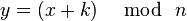
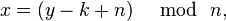
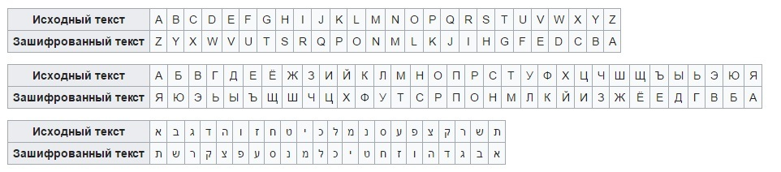
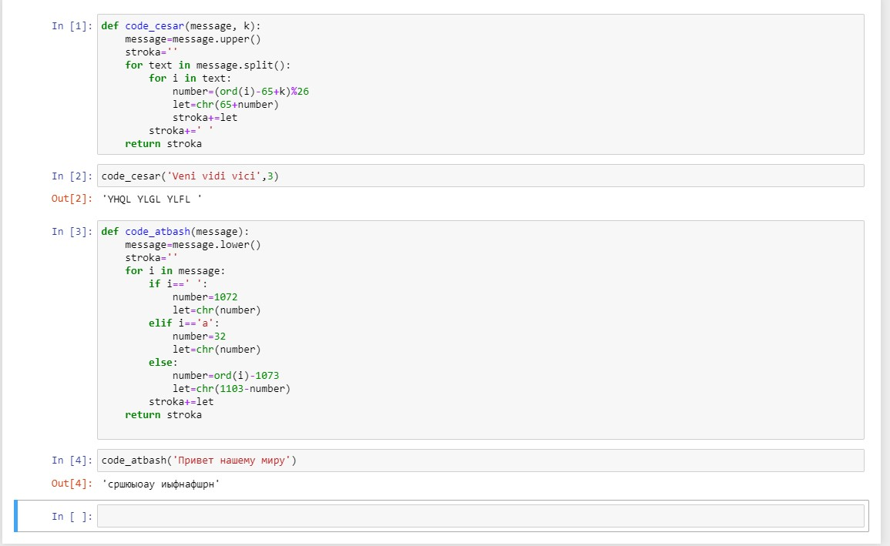

---
## Front matter
lang: ru-RU
title: | Шифр простой замены
author: 
    *Дисциплина: Математические основы защиты информации*  
    *и информационной безопасности*  
    \vspace{2pt}  
    **Студент:** Гонсалес Ананина Луис Антонио, 1032175329  
		**Группа:** НФИмд-02-21  
		**Преподаватель:** д-р.ф.-м.н., проф. Кулябов Дмитрий Сергеевич  
    \vspace{2pt}
date: 15 ноября, 2021, Москва

## Formatting
mainfont: PT Serif
romanfont: PT Serif
sansfont: PT Sans
monofont: PT Mono
toc: false
slide_level: 2
theme: metropolis
header-includes: 
 - \metroset{progressbar=frametitle,sectionpage=progressbar,numbering=fraction}
 - '\makeatletter'
 - '\beamer@ignorenonframefalse'
 - '\makeatother'
aspectratio: 43
section-titles: true

---

# Цели и задачи

## Цель лабораторной работы

Цель данной лабораторной работы- изучить теорию и реализовать шифры простой замены (Шифр Цезаря и Шифр Атбаш)

# Выполнение лабораторной работы

## Шифрование

Шифрование – это технология кодирования и раскодирования данных. Зашифрованные данные -это результат применения алгоритма для кодирования данных с целью сделать их недоступными для чтения. Данные могут быть раскодированы в исходную форму только путем применения специальный ключа. Шифрование является важной частью обеспечения безопасности данных, поскольку оно защищает конфиденциальную информацию от угроз, в числе которых использование вредоносного ПО и несанкционированный доступ третьих сторон. Шифрование данных - это универсальное защитное решение: оно может применяться к части данных, например, к паролю, к информации в файле или даже ко всем данным, содержащимся на носителе.`

## Шифр Цезаря

Шифр Цезаря — это вид шифра подстановки, в котором каждый символ в открытом тексте заменяется символом находящимся на некотором постоянном числе позиций левее или правее него в алфавите. Например, в шифре со сдвигом 3 А была бы заменена на Г, Б станет Д, и так далее.

Математическая модель:

Если сопоставить каждому символу алфавита его порядковый номер (нумеруя с 0), то шифрование и дешифрование можно выразить формулами модульной арифметики:

где ~x — символ открытого текста, ~y — символ шифрованного текста, ~n — мощность алфавита, а ~k — ключ.

## Шифр Атбаш

Шифр простой замены, использованный для еврейского алфавита и получивший оттуда свое название. Шифрование происходит заменой первой буквы алфавита на последнюю, второй на предпоследнюю.

## Результат выполнения работы

# Выводы

В ходе данной лабораторной работы была изучена теория и реализованы шифры простой замены (Шифр Цезаря и Шифр Атбаш)