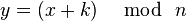

---
# Front matter
title: "Отчёт по лабораторной работе №1"
subtitle: "Шифр простой замены"
author: 
- "Студент: Гонсалес Ананина Луис Антонио, 1032175329"
- "Группа: НФИмд-02-21"
- "Преподаватель: Кулябов Дмитрий Сергеевич,"
- "д-р.ф.-м.н., проф."
date: "Москва 2021"

# Generic otions
lang: ru-RU
toc-title: "Содержание"

# Bibliography
bibliography: bib/cite.bib
csl: pandoc/csl/gost-r-7-0-5-2008-numeric.csl

# Pdf output format
toc: true # Table of contents
toc_depth: 2
lof: true # List of figures
fontsize: 12pt
linestretch: 1.5
papersize: a4
documentclass: scrreprt
## I18n
polyglossia-lang:
  name: russian
  options:
	- spelling=modern
	- babelshorthands=true
polyglossia-otherlangs:
  name: english
### Fonts
mainfont: PT Serif
romanfont: PT Serif
sansfont: PT Sans
monofont: PT Mono
mainfontoptions: Ligatures=TeX
romanfontoptions: Ligatures=TeX
sansfontoptions: Ligatures=TeX,Scale=MatchLowercase
monofontoptions: Scale=MatchLowercase,Scale=0.9
## Biblatex
biblatex: true
biblio-style: "gost-numeric"
biblatexoptions:
  - parentracker=true
  - backend=biber
  - hyperref=auto
  - language=auto
  - autolang=other*
  - citestyle=gost-numeric
## Misc options
indent: true
header-includes:
  - \linepenalty=10 # the penalty added to the badness of each line within a paragraph (no associated penalty node) Increasing the value makes tex try to have fewer lines in the paragraph.
  - \interlinepenalty=0 # value of the penalty (node) added after each line of a paragraph.
  - \hyphenpenalty=50 # the penalty for line breaking at an automatically inserted hyphen
  - \exhyphenpenalty=50 # the penalty for line breaking at an explicit hyphen
  - \binoppenalty=700 # the penalty for breaking a line at a binary operator
  - \relpenalty=500 # the penalty for breaking a line at a relation
  - \clubpenalty=150 # extra penalty for breaking after first line of a paragraph
  - \widowpenalty=150 # extra penalty for breaking before last line of a paragraph
  - \displaywidowpenalty=50 # extra penalty for breaking before last line before a display math
  - \brokenpenalty=100 # extra penalty for page breaking after a hyphenated line
  - \predisplaypenalty=10000 # penalty for breaking before a display
  - \postdisplaypenalty=0 # penalty for breaking after a display
  - \floatingpenalty = 20000 # penalty for splitting an insertion (can only be split footnote in standard LaTeX)
  - \raggedbottom # or \flushbottom
  - \usepackage{float} # keep figures where there are in the text
  - \floatplacement{figure}{H} # keep figures where there are in the text
---

# Цель работы

Цель данной лабораторной работы- изучить теорию и реализовать шифры простой замены (Шифр Цезаря и Шифр Атбаш)

# Теоретические сведения

**Шифр Цезаря**

Также известный как шифр сдвига, код Цезаря или сдвиг Цезаря — один из самых простых и наиболее широко известных методов шифрования [@caesar]. 

Шифр Цезаря — это вид шифра подстановки, в котором каждый символ в открытом тексте заменяется символом находящимся на некотором постоянном числе позиций левее или правее него в алфавите.

Математическая модель:

Если сопоставить каждому символу алфавита его порядковый номер (нумеруя с 0), то шифрование и дешифрование можно выразить формулами модульной арифметики:

где ~x — символ открытого текста, ~y — символ шифрованного текста, ~n — мощность алфавита, а ~k — ключ.

Шифр Цезаря со сдвигом на 3 (английский алфавит):

A заменяется на D, B заменяется на E, Z заменяется на C и так далее.

**Шифр Атбаш**

Шифр простой замены, использованный для еврейского алфавита и получивший оттуда свое название. Шифрование происходит заменой первой буквы алфавита на последнюю, второй на предпоследнюю [@atbash].

# Выполнение работы

​	Шифр Цезарь:

1. Для начала начал разбирать шифр Цезаря, для этого написал функцию code_cesar с двумя нужными параметрами (message, к) где message это сам текст который будем зашифровывать, а к это наш произвольный ключ, моем случае 3.

2. Далее написал нужный алгоритм который взял с файла пдф и с интернета.

3. Потом написал само сообщения и вышло оно зашифровано. 

   Шифр Атбаш:

   1. Написал функцию code_atbash с параметром message.
   2. Далее написал нужный алгоритм.
   3. Потом написал само сообщения и вышло оно зашифровано.
   
   

# Выводы

В итоге в данной лабораторной работы я изучил теорию и реализовал шифры простой замены (Шифр Цезаря и Шифр Атбаш)

# Список литературы{.unnumbered}

:::{#refs}

:::

