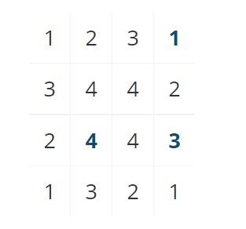
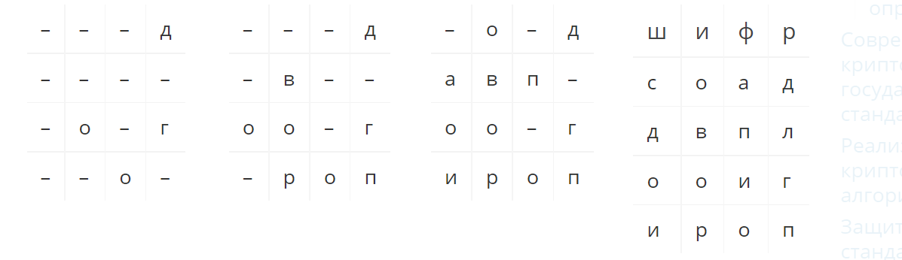

---
# Front matter
title: "Отчёт по лабораторной работе №2"
subtitle: "Шифр простой замены"
author: 
- "Студент: Гонсалес Ананина Луис Антонио, 1032175329"
- "Группа: НФИмд-02-21"
- "Преподаватель: Кулябов Дмитрий Сергеевич,"
- "д-р.ф.-м.н., проф."
date: "Москва 2021"

# Generic otions
lang: ru-RU
toc-title: "Содержание"

# Bibliography
bibliography: bib/cite.bib
csl: pandoc/csl/gost-r-7-0-5-2008-numeric.csl

# Pdf output format
toc: true # Table of contents
toc_depth: 2
lof: true # List of figures
fontsize: 12pt
linestretch: 1.5
papersize: a4
documentclass: scrreprt
## I18n
polyglossia-lang:
  name: russian
  options:
	- spelling=modern
	- babelshorthands=true
polyglossia-otherlangs:
  name: english
### Fonts
mainfont: PT Serif
romanfont: PT Serif
sansfont: PT Sans
monofont: PT Mono
mainfontoptions: Ligatures=TeX
romanfontoptions: Ligatures=TeX
sansfontoptions: Ligatures=TeX,Scale=MatchLowercase
monofontoptions: Scale=MatchLowercase,Scale=0.9
## Biblatex
biblatex: true
biblio-style: "gost-numeric"
biblatexoptions:
  - parentracker=true
  - backend=biber
  - hyperref=auto
  - language=auto
  - autolang=other*
  - citestyle=gost-numeric
## Misc options
indent: true
header-includes:
  - \linepenalty=10 # the penalty added to the badness of each line within a paragraph (no associated penalty node) Increasing the value makes tex try to have fewer lines in the paragraph.
  - \interlinepenalty=0 # value of the penalty (node) added after each line of a paragraph.
  - \hyphenpenalty=50 # the penalty for line breaking at an automatically inserted hyphen
  - \exhyphenpenalty=50 # the penalty for line breaking at an explicit hyphen
  - \binoppenalty=700 # the penalty for breaking a line at a binary operator
  - \relpenalty=500 # the penalty for breaking a line at a relation
  - \clubpenalty=150 # extra penalty for breaking after first line of a paragraph
  - \widowpenalty=150 # extra penalty for breaking before last line of a paragraph
  - \displaywidowpenalty=50 # extra penalty for breaking before last line before a display math
  - \brokenpenalty=100 # extra penalty for page breaking after a hyphenated line
  - \predisplaypenalty=10000 # penalty for breaking before a display
  - \postdisplaypenalty=0 # penalty for breaking after a display
  - \floatingpenalty = 20000 # penalty for splitting an insertion (can only be split footnote in standard LaTeX)
  - \raggedbottom # or \flushbottom
  - \usepackage{float} # keep figures where there are in the text
  - \floatplacement{figure}{H} # keep figures where there are in the text
---

# Цель работы

Цель данной лабораторной работы- изучить теорию и реализовать рассмотренные шифры програмно.

# Теоретические сведения

**Шифры перестановки**

Это метод симметричного шифрования, в котором элементы исходного открытого текста меняют местами. Элементами текста могут быть отдельные символы (самый распространённый случай), пары букв, тройки букв, комбинирование этих случаев и так далее [@perestanovka]. 

**Маршрутное шифрование**

Пусть m и n – некоторые натуральные (т.е. целые положительные) числа, каждое больше 1. Открытый текст последовательно разбивается на части (блоки) с длиной, равной 6 произведений mn (если в последнем блоке не хватает букв, можно дописать до нужной длины произвольный их набор). Блок вписывается построчно в таблицу размерности m×n (т.е. m строк и n столбцов). Криптограмма получается выписыванием букв из таблицы в соответствии с некоторым маршрутом. Этот маршрут вместе с числами m и n составляет ключ шифра.

Чаще всего буквы выписывают по столбцам, которые упорядочиваются в соответствии с паролем: под таблицей подписывается слово, состоящее из n неповторяющихся букв, и столбцы таблицы нумеруются по алфавитному порядку букв пароля. Например, для шифрования открытого текста, выражающего один из главных принципов криптологии: нельзя недооценивать противника, добавим к его 29 буквам еще одну, скажем а, возьмем m=5, n=6, впишем текст в таблицу 5×6 и выберем в качестве пароля слово п а р о л ь:

*нельзя недооц ениват ьпроти вникаа пароль*

Выписывая теперь буквы по столбцам в соответствии с алфавитным порядком букв в пароле, получаем следующую криптограмму: ЕЕНПНЗОАТАЬОВОКННЕЬВЛДИРИЯЦТИА (истинные пробелы в криптографии не выставляются) [@shifr].

**Шифрование с помощью решеток**

Выбирается натуральное число k > 1, и квадрат размерности k×k построчно заполняется числами 1, 2, ..., k. Для примера возьмем k = 2.

Квадрат поворачивается по часовой стрелке на 90° и размещается вплотную к предыдущему квадрату. Аналогичные действия совершаются еще два раза, так чтобы в результате из четырех малых квадратов образовался один большой с длиной стороны 2k.

Далее из большого квадрата вырезаются клетки с числами от 1 до k2, для каждого числа одна клетка. Процесс шифрования происходит следующим образом. Сделанная решетка (квадрат с прорезями) накладывается на чистый квадрат 2k×2k и в прорези по строчкам (т.е. слева направо и сверху вниз) вписываются первые буквы открытого текста. Затем решетка поворачивается на 90° по часовой стрелке и накладывается на частично заполненный квадрат, вписывание продолжается.

После третьего поворота, наложения и вписывания все клетки квадрата будут заполнены. Правило выбора прорезей гарантирует, что при заполнении квадрата буква на букву никогда не попадет. Из заполненного квадрата буквы можно выписать по столбцам, выбрав подходящий пароль. Например, с использованием изображенной выше решетки и пароля ш и ф р открытый текст договор подписали переводится в криптограмму за пять шагов:

Итоговая криптограмма: ОВОРДЛГПАПИОСДОИ.

**Таблица Виженера**

Шифр Виженера состоит из последовательности нескольких шифров Цезаря с различными значениями сдвига. Для зашифровывания может использоваться таблица алфавитов, называемая tabula recta или квадрат (таблица) Виженера. Применительно к латинскому алфавиту таблица Виженера составляется из строк по 26 символов, причём каждая следующая строка сдвигается на несколько позиций. Таким образом, в таблице получается 26 различных шифров Цезаря. На каждом этапе шифрования используются различные алфавиты, выбираемые в зависимости от символа ключевого слова. Например, предположим, что исходный текст имеет такой вид:

ATTACKATDAWN

Человек, посылающий сообщение, записывает ключевое слово («LEMON») циклически до тех пор, пока его длина не будет соответствовать длине исходного текста:

LEMONLEMONLE

Первый символ исходного текста («A») зашифрован последовательностью L, которая является первым символом ключа. Первый символ зашифрованного текста («L») находится на пересечении строки L и столбца A в таблице Виженера. Точно так же для второго символа исходного текста используется второй символ ключа; то есть второй символ зашифрованного текста («X») получается на пересечении строки E и столбца T. Остальная часть исходного текста шифруется подобным способом [@vizener].

Исходный текст:       ATTACKATDAWN
Ключ:                 LEMONLEMONLE
Зашифрованный текст:  LXFOPVEFRNHR

# Выполнение работы

# Выводы

В итоге в данной лабораторной работы я изучил теорию и реализовал рассмотренные шифры програмно.

# Список литературы{.unnumbered}

:::{#refs}

:::

